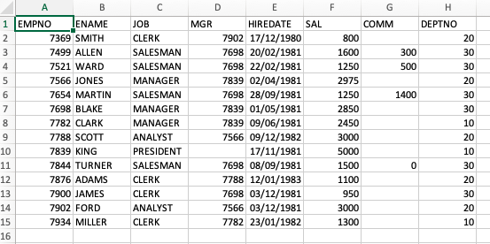

# Using Excel VBA to convert sheet data into executable SQL

## Scenario

I have been using Excel for longer than I care to remember. I have used it long enough to appreciate its merits
and to be aware of its deficiencies and dangers. However, the choice to use it or not is not always up to me but is dictated
by others with whom I interact who use it extensively to collect, analyse and store data. Across many business
areas, it has become almost a _lingua franca_ for data transfer so even those who hate it often have to deal with it
and its many quirks and annoyances. I frequently need to get the sheet data quickly into a relational database of some sort.
In the past, that was Oracle but these days it is SQLite or PostgreSQL. I also use a Mac so I am more limited when it comes
to drivers for connecting Excel to these databases. Of course, I could use Python or R to extract the data from an Excel sheet and load
it to a relational database. However, I often just need to quickly look at the data, determine the column data types, make some edits
or make some data change requests to the sheet provider. To achieve this, I have written some VBA functions that can be called
as user-defined functions in the spreadsheet itself. These functions perform the following:

- Examine each data input column and determine a suitable database column type for the data in that column.
- Use the column header row as database column names and match these up with the inferred column data types to
generate a _CREATE TABLE_ SQL statement.
- Generate an _INSERT INTO_ SQL statement for each data row with the correct formatting for each column data type.

The generated SQL can then be executed by a suitable database client program. I use the PostgreSQL RDBMS with
pgAdmin as the client. Most of the generated code works for SQLite too and can be tweaked for other RDBMs.
Because I developed the code on a Mac, I have only bare bones VBA and cannot avail of COM add-ons such as dictionaries
or regular expression which are available on the Windows platform. That said, it makes the code more verbose but
also keeps it very simple so that anyone with even a rudimentary knowledge of Excel VBA should be able to follow along.
The code should also run on either Mac Excel or Windows Excel without issue.

Here is a screenshot of the input data:

[]

## To use the module

- Download the _modSqlGenerator.bas_ file.
- I run the code from my __Personal.xlsb__ workbook to ensure it is available at all times in Excel.
- You can do the same but you may want to load the module into a macro-enabled ( _xlsm_ ) workbook initially
for testing and to reassure yourself that the code is safe. You should treat all downloaded VBA code  with suspicion 
to ensure that it is not doing anything dangerous either inadvertently or because of malicious intent on the part of the code writer.

You should now have access to the functions needed to generate the SQL.
 

## Data

I have taken the _emp_ table from the old Oracle training database known as _scott_. It has the
main data types that we will use. See the Excel file named _emp.xlsx_ in this repo.

## SQL dialect

SQL is a common standard implemented by a vast number of relational and non-relational databases
as well as by various data analysis software platforms. Although there is an _SQL standard_, to the best of 
my knowledge, no system implements the standard in its entirety and each 'dialect' of SQL has its own
non-standard extensions. I have chosen to generate the PostgreSQL standard in these examples because it is the one I 
mostly use these days; it is also free and is possibly the RDBMS that most closely adheres to the standard.
Most of the generated code will also work in SQLite which is more forgiving when it comes to column types but the
_to_date_ would need to be changed to allow it to use the generated code. A few more tweaks for the column
types would be needed for it to work in Oracle while SQL Server and MySQL would likely need more extensive 
changes. Since the code is available here, it should be relatively easy to tweak it to work with your preferred RDBMS.

## Steps

- Download the spreadsheet to follow along.
- Insert a column under the column names to create a blank row.
- The following steps assume the code is in _Personal.xlsb_, if it is in a macro-enabled Excel file of your choosing
and the data is also in this workbook, then drop the __Personal.xlsb!__ from the function calls given below.
- In cell A2 of this row enter the formula: `=PERSONAL.XLSB!COLUMN_DATATYPE(A3:A16)`. 
- Drag it to the right using the lower right black cross, 
you should now have the data types inferred for each column in the second row.
- The _CREATE TABLE_ DDL statement is created in cell I2 by entering the formula:
 `=PERSONAL.XLSB!CREATE_TABLE_DDL("emp", A1:H1,A2:H2)`
- To generate the _INSERT INTO_ SQL statements for each row, enter the following formula in
cell I3: `=PERSONAL.XLSB!INSERT_VALUES_SQL("emp", A$1:H$1,A$2:H$2,A16:H16)`
- Click the black arrow on the lower right of cell I3 to copy down the formula.
- Note the dollar signs are used to create absolute row references for the second and third arguments to the
function call. These are crucial to ensure that each _INSERT_ SQL statement refers to the same 
column names and column types for each data row.
- To test the code, I  removed the double quotes enclosing the _CREATE TABLE_ statement that were inserted by Excel to preserve the embedded new lines and then
pasted it into the pgAdmin _Query Tool_ window and executed it without error


Here is the generated SQL with the offending double quotes removed from the _CREATE TABLE_ statement.

```{sql}
CREATE TABLE emp(EMPNO INTEGER,
    ENAME TEXT,
    JOB TEXT,
    MGR INTEGER,
    HIREDATE DATE,
    SAL INTEGER,
    COMM INTEGER,
    DEPTNO INTEGER);
INSERT INTO  emp(EMPNO,ENAME,JOB,MGR,HIREDATE,SAL,COMM,DEPTNO) VALUES(7369,'SMITH','CLERK',7902,to_date('1980-12-17', 'YYYY-MM-DD'),800,NULL,20);
INSERT INTO  emp(EMPNO,ENAME,JOB,MGR,HIREDATE,SAL,COMM,DEPTNO) VALUES(7499,'ALLEN','SALESMAN',7698,to_date('1981-02-20', 'YYYY-MM-DD'),1600,300,30);
INSERT INTO  emp(EMPNO,ENAME,JOB,MGR,HIREDATE,SAL,COMM,DEPTNO) VALUES(7521,'WARD','SALESMAN',7698,to_date('1981-02-22', 'YYYY-MM-DD'),1250,500,30);
INSERT INTO  emp(EMPNO,ENAME,JOB,MGR,HIREDATE,SAL,COMM,DEPTNO) VALUES(7566,'JONES','MANAGER',7839,to_date('1981-04-02', 'YYYY-MM-DD'),2975,NULL,20);
INSERT INTO  emp(EMPNO,ENAME,JOB,MGR,HIREDATE,SAL,COMM,DEPTNO) VALUES(7654,'MARTIN','SALESMAN',7698,to_date('1981-09-28', 'YYYY-MM-DD'),1250,1400,30);
INSERT INTO  emp(EMPNO,ENAME,JOB,MGR,HIREDATE,SAL,COMM,DEPTNO) VALUES(7698,'BLAKE','MANAGER',7839,to_date('1981-05-01', 'YYYY-MM-DD'),2850,NULL,30);
INSERT INTO  emp(EMPNO,ENAME,JOB,MGR,HIREDATE,SAL,COMM,DEPTNO) VALUES(7782,'CLARK','MANAGER',7839,to_date('1981-06-09', 'YYYY-MM-DD'),2450,NULL,10);
INSERT INTO  emp(EMPNO,ENAME,JOB,MGR,HIREDATE,SAL,COMM,DEPTNO) VALUES(7788,'SCOTT','ANALYST',7566,to_date('1982-12-09', 'YYYY-MM-DD'),3000,NULL,20);
INSERT INTO  emp(EMPNO,ENAME,JOB,MGR,HIREDATE,SAL,COMM,DEPTNO) VALUES(7839,'KING','PRESIDENT',NULL,to_date('1981-11-17', 'YYYY-MM-DD'),5000,NULL,10);
INSERT INTO  emp(EMPNO,ENAME,JOB,MGR,HIREDATE,SAL,COMM,DEPTNO) VALUES(7844,'TURNER','SALESMAN',7698,to_date('1981-09-08', 'YYYY-MM-DD'),1500,0,30);
INSERT INTO  emp(EMPNO,ENAME,JOB,MGR,HIREDATE,SAL,COMM,DEPTNO) VALUES(7876,'ADAMS','CLERK',7788,to_date('1983-01-12', 'YYYY-MM-DD'),1100,NULL,20);
INSERT INTO  emp(EMPNO,ENAME,JOB,MGR,HIREDATE,SAL,COMM,DEPTNO) VALUES(7900,'JAMES','CLERK',7698,to_date('1981-12-03', 'YYYY-MM-DD'),950,NULL,30);
INSERT INTO  emp(EMPNO,ENAME,JOB,MGR,HIREDATE,SAL,COMM,DEPTNO) VALUES(7902,'FORD','ANALYST',7566,to_date('1981-12-03', 'YYYY-MM-DD'),3000,NULL,20);
INSERT INTO  emp(EMPNO,ENAME,JOB,MGR,HIREDATE,SAL,COMM,DEPTNO) VALUES(7934,'MILLER','CLERK',7782,to_date('1982-01-23', 'YYYY-MM-DD'),1300,NULL,10);
```


## Wrap-up

Over the years, I have found these functions to be useful for my day-to-day work. The function _COLUMN_DATATYPE_
has been surprisingly useful because it allows me to check my assumptions about columns. Because Excel does not have the concept
of a column data type, text, dates or even images can appear in columns that are assumed to be numeric, for example. That function I mentioned
assigns the _TEXT_ type to a column when it detects mixed types of this nature.

The code I present here is basic and does not deal at all with embedded charts or images. Currently, __it ignores the _time_ part of date-time cells__..
I have tested it for numeric types (double and integer), text, dates and logical. For logical columns, it assigns the column type __BOOLEAN__ which is supported
by PostgreSQL but not by all RDBMs.

## Warning/Disclaimer

As always, treat all downloaded code with caution. I strongly recommend that you read and test the code given here before using it in earnest.
